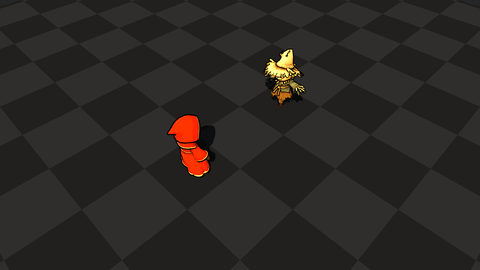

# VFX Practice

A Godot VFX lab. Open `godot/project.godot` in Godot 4.7 and pick effects from the in-engine gallery.

Web export is the Godot HTML5 build (no extra HTML/JS shell).

https://pukkycoopie.github.io/vfx_practice/

<!-- gallery:start -->
## Gallery

### Player Idle

### Flame Jet

<!-- gallery:end -->
