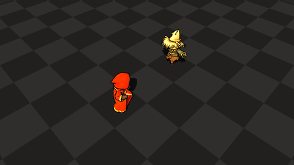
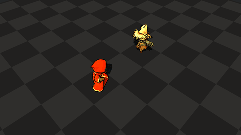

# VFX Practice Archive

I'm a beginner learning game visual effects. With AI assistance, I'm currently working on some basic effects in Godot for my next game project. This repository serves as an archive for my practice work.

[https://pukkycoopie.github.io/vfx_practice/](https://pukkycoopie.github.io/vfx_practice/)  
PCK file is huge, so it might take a while to load.

## Gallery

<!--
  Hand-authored HTML gallery. Do not convert to Markdown tables (no colspan).
  Two effects per row: title+date, then GIFs with colspan=2.
  A third effect starts two new rows; leave the right pair empty until a fourth exists.
  Capture/export must not rewrite this table.
-->
<table>
<tr>
<td><strong>Fire Flame</strong></td>
<td align="right">2026/09/07</td>
<td><strong>Water Jet</strong></td>
<td align="right">2026/09/09</td>
</tr>
<tr>
<td colspan="2" align="center"></td>
<td colspan="2" align="center"></td>
</tr>
<tr>
<td><strong>Lightning Jet</strong></td>
<td align="right">2026/09/11</td>
<td><strong>Frost Jet</strong></td>
<td align="right">2026/09/12</td>
</tr>
<tr>
<td colspan="2" align="center"></td>
<td colspan="2" align="center"></td>
</tr>
</table>

## License

**Code, shaders, and VFX** in this repository may be used freely, including in personal and commercial projects. No attribution is required.

**3D models** (under `godot/assets/models/`) are not free to use. They were generated through paid AI generation, and remain my property. Do not copy, redistribute, or use them in your own work without permission.
